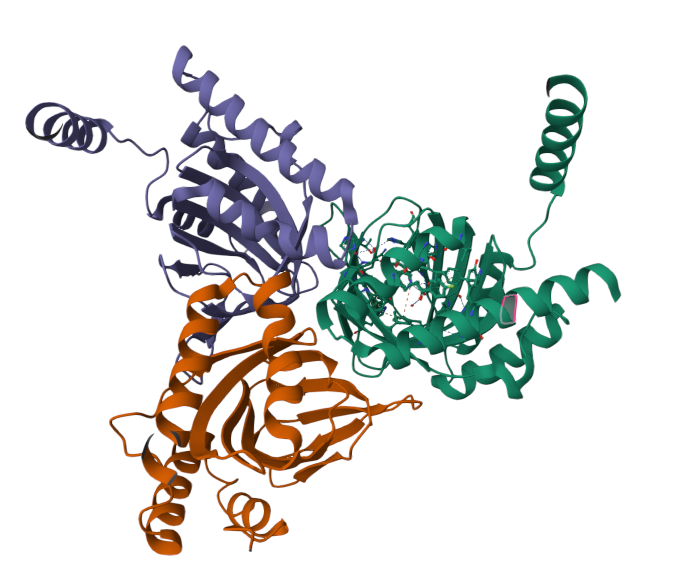

# Sigma non-opioid intracellular receptor 1
- [CHEMBL287](https://www.ebi.ac.uk/chembl/explore/target/CHEMBL287)
- trimeric structure
- ligand-operated molecular chaperone
- on endoplasmatic reticulum
- biological function
    - calcium signaling and homeostasis
    - ion channel modulation
    - cellular stress response
 
  

